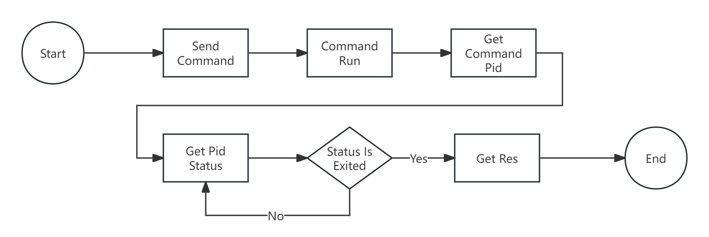

# qga_box

Package QGA Command

## Process



* 1、Send Command: Use qemu-agent-command send command and params to vm at the vm host.
* 2、Command Run: Vm running command then return a PID.
* 3、Get PID Status: Use guest-exec-status send command and check command res status, if status is not 'Exited', retry it. You can set retry count in cfg.conf.
* 4、Get Res: The status is Exited, get stdout or error end this operation.

### Custom

To be supplemented

## Requirements

* libvirt-client
* virt-manager
* python 3.8+

## Deploy

### Installation

#### Install by 'setup.sh'

```
sh setup.sh
```

### Config

#### cfg.conf
* log_file：Log path and name
* thread_name：Logger name
* repeat_count: Retry get PID status count

## Usage

### 1、listen.py

We use the Supervisor to start the script. Supervisor is a client/server system that allows its users monitor and control a number of processes on UNIX-like operating systems.

You can use this tool to ensure the script is running, you also can use other tools.

### 2、Worker and Queue

python box_class.py -h
eg: python box_class.py vm_instance_id --cmd_line ps --params a

## Developing and Contributing
You're highly encouraged to participate in our development. Please submit Issues and Pull Requests with pleasure.

## Support and Community

### QQ Group
Join our official Open Source QQ Group 394256506.

### Mail
Contact us by <394256506@qq.com>


### Bug Track
If you have any suggestions, bug reports, or annoyances please report them to our issue tracker at <https://github.com/Dtap117/qga_box/issues>

### Wiki
<https://github.com/Dtap117/qga_box/wiki>


<!--### Blog
The official blog of our team http://autohomeops.corpautohome.com-->

### License
This software is licensed under the Apache License. See the LICENSE file in the top distribution directory for the full license text.
